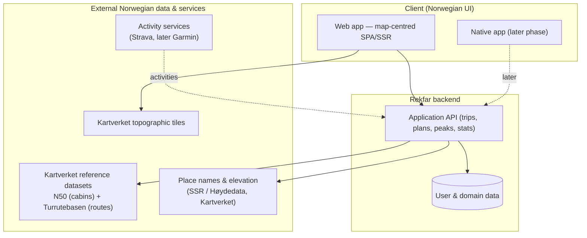

# Architecture Vision (TOGAF Phase A)

## 1. Purpose of this document

This is the "north star" for Rekfar. It states the problem, who it is for, the
value it delivers, its scope, and a high-level picture of the target architecture.
Everything else in `docs/` elaborates on this.

## 2. Problem statement

People who hike and climb in Norway want a single, trustworthy place to:

- **Remember** the trips they have done — where, when, which summit, how much ascent.
- **Plan** the trips they still want to do, and keep a wishlist of peaks.
- **See it on a map** — both their own history and the catalogue of known mountain
  tops (*fjelltopper*) and marked trails (*turruter*) around Norway.

Today this is scattered across generic note apps, photo libraries, spreadsheets,
and several fitness/GPS apps that are global, subscription-driven, and not built
around the Norwegian idea of a personal **turloggbok**. None of them combine a
clean Norwegian-scoped map of peaks and trails with a simple, private, personal log
of "done" and "want to do".

## 3. Vision statement

> **Rekfar is the personal logbook for hiking and climbing in Norway — a map of
> where you have been and where you want to go.**

It should feel like a well-kept notebook with a beautiful map attached: quick to log
a trip, satisfying to look back on, and motivating to plan the next one. It is
personal, private by default, low-cost to run, and built on Norway's excellent open
map and trail data.

## 4. Stakeholders

| Stakeholder | Interest / concern |
| --- | --- |
| **The hiker (primary user)** | Log trips quickly; plan future trips; see history and stats on a map; keep data private and portable. |
| **The maintainer (you)** | Build and run it cheaply and sustainably as one person; keep the codebase and docs approachable. |
| **Data providers (Kartverket)** | Their terms of use and attribution requirements are respected. |
| **Future contributor** | Can understand the architecture and pick up work from the documentation. |
| **Future native-app user** | Same account and data, usable from a phone app later. |

## 5. Value proposition

- **Norway-native:** Real topographic maps and a real catalogue of peaks and trails,
  not a global approximation.
- **Built on Norway's authoritative open data:** peaks, routes, and cabins sourced from
  **Kartverket** — the place-name register, the national elevation model, N50, and
  Turrutebasen ([ADR-0012](../adr/0012-kartverket-primary-source.md)).
- **Two-in-one:** Both a *log* (done) and a *plan* (want to do) in the same map-centred
  view — a "life list" for Norwegian summits.
- **Logs itself:** connect **Strava** (or later Garmin) and trips auto-check the peaks
  and cabins you visit ([ADR-0008](../adr/0008-activity-tracking-integrations.md)).
- **Two logbooks in one:** a **private diary (dagbok)** for yourself and a **public
  guestbook (gjestebok)** greeting at the summit or cabin
  ([ADR-0009](../adr/0009-private-and-public-logbook.md)).
- **Private and yours:** Trips are private by default and exportable at any time.
- **Calm and free:** No subscriptions, no ads, no pressure — a hobby tool made well.

## 6. Scope

### In scope

- Personal trip logging (hikes and summit trips) with date, route/track, ascent,
  photos, notes, and difficulty.
- Trip planning and a peak/trip wishlist.
- A map of Norway showing: known mountain tops, marked trails, and the user's own
  trips (done and planned).
- A catalogue of Norwegian **mountain tops (fjelltopper)**, **routes (turruter)**, and
  **cabins (hytter)** sourced from **Kartverket** open datasets; users can browse, search,
  and tick them off.
- **Automatic logging** by connecting a GPS activity service (**Strava**, later Garmin):
  uploaded activities auto-check visited peaks, cabins, and routes.
- A two-tier logbook: **private diary notes (dagboknotat)** and a **public guestbook
  (gjestebok)** of greetings on summits and cabins.
- **Connections between users** (friends, tagging, shared wishlist) — a later stage.
- Personal statistics and simple achievements (e.g. peaks bagged, total ascent).
- GPX import (tracks), photos (later phase), and data export.

### Out of scope (at least initially)

- Countries other than Norway ([ADR-0002](../adr/0002-scope-norway-only.md)).
- Real-time GPS tracking/recording during a hike (import GPX instead, at first).
- A full social network / feed. (A **public guestbook** and later **friends / tagging /
  shared wishlist** are limited, privacy-controlled features — not an open feed.)
- Monetisation of any kind.
- Turn-by-turn navigation and offline routing.
- A native mobile app in the first phase ([ADR-0004](../adr/0004-web-first-native-later.md)).

## 7. High-level target architecture (conceptual)

Notes:

- The **web app** talks to a **Rekfar API** for the user's own data (trips,
  plans, stats) and loads **map tiles directly** from Kartverket in the browser.
- **Reference data** (peaks, routes, cabins, elevation) comes from **Kartverket**,
  ingested/cached by the backend rather than fetched live on every request, for resilience
  and to respect provider limits (Principle P3). Each place carries a **stable Kartverket
  identifier**, and optionally a link out to a human-written description
  ([ADR-0012](../adr/0012-kartverket-primary-source.md)).
- **Activity services** (Strava, later Garmin) can feed uploaded activities into the API
  to **auto-check** visited peaks and cabins
  ([ADR-0008](../adr/0008-activity-tracking-integrations.md)).
- The API is deliberately kept as the single business-logic boundary so a **native
  app** can reuse it later (Principle P6).

The concrete technology and the specific map provider are **deliberately deferred**
— see [ADR-0005](../adr/0005-tech-stack-deferred.md) and
[ADR-0006](../adr/0006-map-provider-deferred.md). This vision is written to be valid
regardless of those choices.

## 8. Constraints & assumptions

- **Constraint:** Near-zero budget; single maintainer (Principles P1, P7).
- **Constraint:** Norwegian UI, English docs, bilingual domain terms (P5).
- **Constraint:** Respect open-data licences and attribution (P3).
- **Assumption:** Kartverket tiles and Norwegian trail/peak datasets remain freely
  available under acceptable terms. (Tracked as a risk — see the roadmap.)
- **Assumption:** Users are comfortable with a Norwegian-language interface.

## 9. Definition of success (for the MVP)

The MVP is successful if a single user can, in the web app: create an account, log a
completed summit trip with a peak and a **private diary note (dagboknotat)**, add a
planned trip, and see both on a map of Norway alongside a catalogue of known peaks
**sourced from Kartverket** — all in Norwegian, running on free infrastructure. See the
[roadmap](06-roadmap.md) for how we get there.
