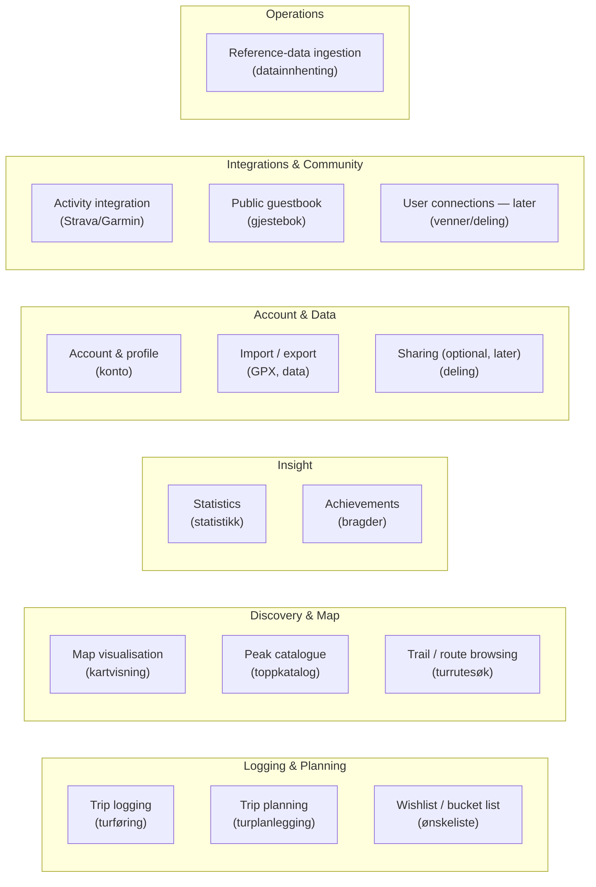
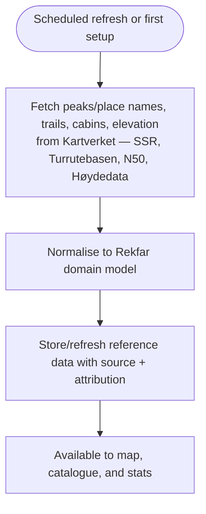
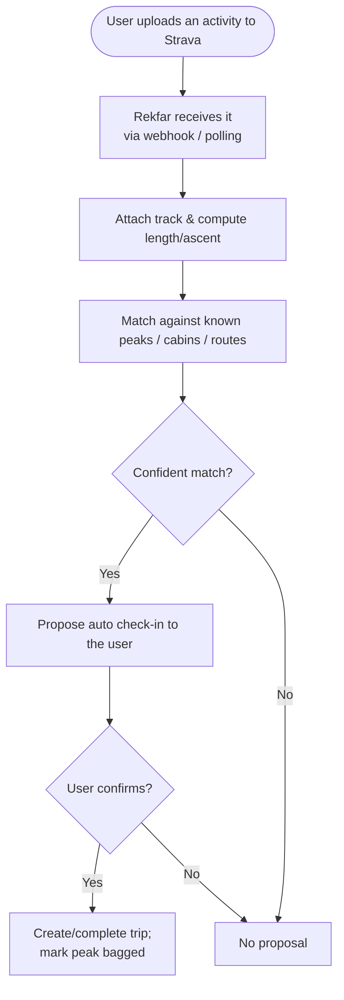

# Business Architecture (TOGAF Phase B)

This describes *what* Rekfar does in business/domain terms — the actors, the
capabilities, and the key processes — independent of technology. For a hobby
project the "business" is really the product's purpose and the user's activity.

## 1. Actors (roles)

| Actor | English | Norwegian | Description |
| --- | --- | --- | --- |
| A1 | Hiker (registered user) | Turgåer / bruker | The primary actor. Logs trips, plans trips, browses peaks and the map. |
| A2 | Visitor (unauthenticated) | Besøkende | Someone not logged in. May browse the public map and peak catalogue (read-only), then register. |
| A3 | Maintainer / administrator | Vedlikeholder / administrator | Operates the service, manages reference-data ingestion, moderates any shared content. |
| A4 | External data provider | Ekstern datakilde | Kartverket (map tiles, SSR, Høydedata, N50, Turrutebasen). Not a user, but a source the system depends on. |

Personas that make these concrete are in the [use cases](../use-cases/use-cases.md).

## 2. Business capabilities

A capability is *what the product is able to do*, not *how*. Rekfar's capability
map:



| ID | Capability | Notes |
| --- | --- | --- |
| C1 | **Trip logging** | Record a completed trip: date, peak(s), route/track, ascent, difficulty, conditions, and **private diary notes (dagboknotat)**; photos in a later phase. |
| C2 | **Trip planning** | Create a planned/future trip; convert it to a completed trip after doing it. |
| C3 | **Wishlist** | Maintain a list of peaks/trips the user wants to do (peak bagging / *toppjakt*). |
| C4 | **Map visualisation** | Show peaks, trails, and the user's trips on a topographic map of Norway with toggleable layers. |
| C5 | **Peak & place catalogue** | Browse/search Norwegian **mountain tops, routes, and cabins** sourced from **Kartverket**; view details and own history. |
| C6 | **Trail browsing** | Browse marked trails/routes near a location or peak. |
| C7 | **Statistics** | Aggregate the user's activity: peaks bagged, total ascent, trips per year, by region. |
| C8 | **Achievements** | Light gamification — milestones (e.g. "10 peaks over 1500 m"). |
| C9 | **Account & profile** | Registration, login, profile, privacy settings. |
| C10 | **Import / export** | GPX import for tracks; full data export (Principle P4). |
| C11 | **Sharing** *(later)* | Optionally share a trip or a public profile via link. |
| C12 | **Reference-data ingestion** | Maintainer/system process to fetch and refresh peaks, routes, cabins, and elevation from **Kartverket** (SSR, Høydedata, N50, Turrutebasen) by scheduled bulk download. |
| C13 | **Activity integration** | Connect **Strava** (later Garmin); import activities and propose **auto check-ins** of visited peaks/cabins/routes, attaching the track. |
| C14 | **Public guestbook** | Post and view public **greetings (gjestebok)** on summit/cabin/route pages; includes light moderation. |
| C15 | **User connections** *(later)* | Friends (**venner**), tagging users on trips, and sharing a wishlist. |

## 3. Core business processes

### 3.1 Log a completed trip (turføring)

```mermaid
flowchart TD
    S([Hiker returns from a trip]) --> A[Open "New trip"]
    A --> B{Was it planned?}
    B -- Yes --> C[Pick the planned trip]
    B -- No --> D[Create new]
    C --> E[Set date & select peak from catalogue]
    D --> E
    E --> F[Optionally import GPX track]
    F --> G[Add ascent, difficulty, conditions, photos, notes]
    G --> H[Save]
    H --> I[Trip appears on map & in stats;<br/>peak marked as bagged]
    I --> T([Done])
```

### 3.2 Plan a future trip (turplanlegging)

```mermaid
flowchart TD
    S([Hiker wants to do a peak]) --> A[Find peak on map or in catalogue]
    A --> B[Add to wishlist or create planned trip]
    B --> C[Set target date, notes, chosen route]
    C --> D[Planned trip shows on map in "planned" style]
    D --> E{Trip completed?}
    E -- Yes --> F[Convert to completed trip -> turføring]
    E -- Not yet --> D
```

### 3.3 Reference-data ingestion (datainnhenting)



### 3.4 Automatic check-in from an activity (automatisk avkryssing)



## 4. Capability → requirement traceability (overview)

| Capability | Primary requirements |
| --- | --- |
| C1 Trip logging & diary | FR-LOG-*, FR-BOOK-* (see [functional requirements](../requirements/functional-requirements.md)) |
| C2 Trip planning | FR-PLAN-* |
| C3 Wishlist | FR-PLAN-* |
| C4 Map visualisation | FR-MAP-* |
| C5 Peak & place catalogue | FR-PEAK-*, FR-REF-* |
| C6 Trail browsing | FR-MAP-* / FR-PEAK-* / FR-REF-* |
| C7 Statistics | FR-STAT-* |
| C9 Account | FR-ACC-* |
| C10 Import/export | FR-DATA-* |
| C12 Ingestion | FR-REF-* |
| C13 Activity integration | FR-ACT-* |
| C14 Public guestbook | FR-BOOK-* |
| C15 User connections (later) | FR-SOCIAL-* |

## 5. Business-level constraints

- The product must be operable and affordable by one person (Principle P1).
- All map/trail/peak data must come from sources whose licences permit this use and
  whose attribution is honoured (Principle P3).
- Norwegian is the language of the product; the domain vocabulary is fixed by the
  [glossary](../glossary.md).
