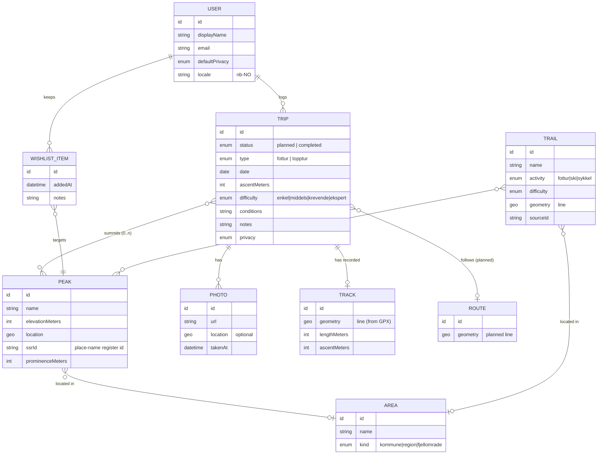
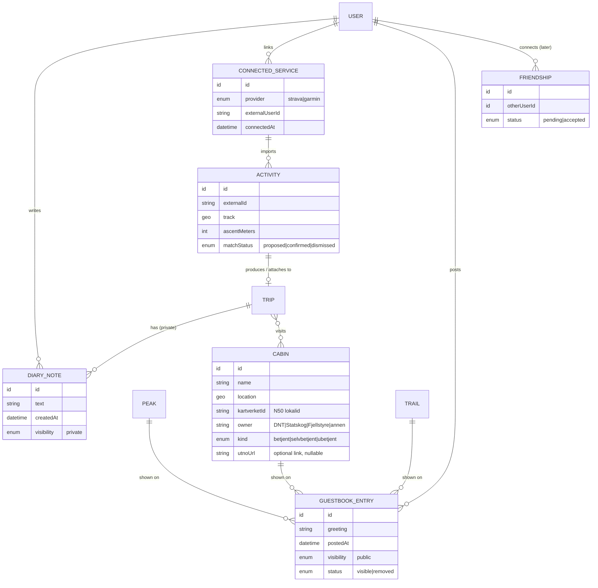

# Data Architecture (TOGAF Phase C — Data)

This describes the information Rekfar holds: the domain model, the distinction
between *user data* and *reference data*, the external sources, and key data
concerns (coordinate systems, privacy, portability). It is **logical** — no specific
database technology is assumed (that is deferred; see
[ADR-0005](../adr/0005-tech-stack-deferred.md)).

## 1. Two kinds of data

| Kind | Owner | Examples | Notes |
| --- | --- | --- | --- |
| **User data** | The user | Account, trips (done/planned), wishlist, tracks, **private diary notes**, public **guestbook posts**, **connected services** & imported **activities**, photos (later), stats | Private by default (P9); portable (P4). |
| **Reference data** | External providers, cached by us | Mountain tops, routes, **cabins (hytter)**, place names, elevation — sourced from **Kartverket** | Read-mostly; ingested and refreshed (capability C12). Each record keeps its Kartverket id, source dataset, and fetch date. Attribution required (P3). |

Keeping these separate matters: reference data can be rebuilt from sources; user data
is irreplaceable and must be backed up and exportable.

## 2. Conceptual domain model

## 3. Key entities

- **User (bruker):** account, display name, email, locale (`nb-NO` first),
  default privacy. Minimal by design (P9).
- **Trip (tur):** the central entity. A `status` of `planned` or `completed`
  unifies planning and logging — a plan becomes a log by changing status and adding
  outcome data. `type` distinguishes a hike (*fottur*) from a summit trip (*topptur*).
  A trip may reference 0..n **peaks** (a traverse can bag several).
- **Peak (fjelltopp):** reference data — name, location, and `ssrId` (the SSR
  `stedsnummer`) from the place-name register; elevation (moh.) **derived** by sampling
  Kartverket's DTM at that point; optional prominence (*primærfaktor*). Which SSR points
  qualify as a peak is a documented rule we own (FR-REF-11,
  [ADR-0012](../adr/0012-kartverket-primary-source.md)).
- **Trail (turrute):** reference data — a marked route with activity type,
  difficulty, and line geometry, sourced from **Turrutebasen** (`Fotrute`, `Skiløype`,
  `Sykkelrute`, `AnnenRute`).
- **Track (spor):** the user's actual recorded line, typically from an imported GPX;
  distinct from the planned **Route (rute)**.
- **Photo (bilde), Note (notat):** user content attached to a trip.
- **Area (område):** administrative or natural grouping (municipality *kommune*,
  region, mountain area *fjellområde*) used for filtering and stats.
- **Wishlist item (ønskeliste):** a peak (or trip idea) the user wants to do.

### 3b. Additional entities (external references, activities, guestbook, connections)

These extend the model for the features in
[ADR-0012](../adr/0012-kartverket-primary-source.md),
[ADR-0008](../adr/0008-activity-tracking-integrations.md), and
[ADR-0009](../adr/0009-private-and-public-logbook.md).

Key points:

- **External references:** `PEAK`, `TRAIL`, and the new **`CABIN` (hytte)** each carry a
  **stable Kartverket identifier** (SSR `stedsnummer`, or the N50 / Turrutebasen
  `lokalid`) plus their source dataset and fetch date — the join key for refresh and
  reconciliation (FR-REF-6). They may *additionally* carry a **nullable `utnoUrl`** link
  to a human-written description (FR-REF-7); every view must render without it
  ([ADR-0012](../adr/0012-kartverket-primary-source.md)).
- **Cabin attributes come straight from N50:** `kind` is N50's `betjeningsgrad`
  (`betjent` / `selvbetjent` / `ubetjent`) and `owner` is its `eier`
  (DNT / Statskog / Fjellstyre / annen).
- **Two-tier logbook:** **`DIARY_NOTE`** is always **private** to its author and belongs
  to a trip; **`GUESTBOOK_ENTRY`** is **public** and belongs to a place (peak/cabin/
  route). The `visibility` values are fixed and never cross over
  ([ADR-0009](../adr/0009-private-and-public-logbook.md)).
- **Activity import:** a **`CONNECTED_SERVICE`** (Strava/Garmin) imports **`ACTIVITY`**
  records; an activity may produce or attach to a `TRIP`, with `matchStatus` capturing
  the user-confirmable auto check-in ([ADR-0008](../adr/0008-activity-tracking-integrations.md)).
- **Connections (later):** **`FRIENDSHIP`** links two users; sharing (wishlist, tags) is
  gated by accepted friendships. Deferred — see the [roadmap](06-roadmap.md).

## 4. Reference-data sources

**Primary basis:** **Kartverket**, across four datasets — SSR for place names and
coordinates, Høydedata for elevation, N50 Kartdata for cabins, and Turrutebasen for
routes — plus the topographic base map. See
[ADR-0012](../adr/0012-kartverket-primary-source.md).

| Data | Primary source | Access | Notes |
| --- | --- | --- | --- |
| **Peak names & coordinates** | **SSR (Sentralt stedsnavnregister)** via Kartverket / Geonorge | Open REST/JSON at `ws.geonorge.no/stedsnavn/v1/` (no key) or full dataset download | **Primary core data.** `stedsnummer` is the stable external id; filter by `navneobjekttype` per the peak rule (FR-REF-11). |
| **Elevation / terrain** | **Kartverket Høydedata (DTM)** | WCS/WFS/WMS + REST; elevation-profile WPS API | Peak elevation is *sampled* here — SSR carries no height. Also drives ascent calculation and elevation profiles. |
| **Cabins (hytter)** | **Kartverket N50 Kartdata — `Turisthytte`** (building type 956) | Geonorge download (FGDB, GML, PostGIS, SOSI) + WMS/WMTS | Carries `navn`, `betjeningsgrad` (betjent/selvbetjent/ubetjent) and `eier` (DNT/Statskog/Fjellstyre/annen) — maps directly onto `CABIN`. |
| **Marked trails/routes** | **Turrutebasen ("Tur- og friluftsruter")** via Geonorge/Kartverket | Geonorge download API (preferred), WMS, WFS | Object types `Fotrute`, `Skiløype`, `Sykkelrute`, `AnnenRute`. |
| Trailheads, parking, POIs | **Turrutebasen `Ruteinfopunkt`** | as above | Route infrastructure: trailheads, parking, toilets, viewpoints. |
| Topographic base map tiles | **Kartverket — Topografisk norgeskart** | WMS/WMTS tile services (free) | Loaded in the browser; not stored by us. Attribution required. |
| User activities (tracks, auto check-in) | **Strava** (primary), **Garmin** (later) | OAuth + webhooks/polling | Per-user connected sources, not shared reference data; see [ADR-0008](../adr/0008-activity-tracking-integrations.md). |

> **Licensing note:** every Kartverket dataset above is a free product under **CC BY 4.0**,
> so the single attribution **"© Kartverket"** — linked where possible — covers all of
> them (NFR-LEGAL-2). Strava has its own branding and non-commercial terms. Confirm the
> current terms before ingesting. Because these are published national datasets, the
> reference store is fully rebuildable by re-import (NFR-INTEG-6).

## 5. Geospatial concerns

- **Coordinate system:** Store user and reference geometry in **WGS84
  (EPSG:4326)** as the canonical lat/long for portability (GPX, web maps). Kartverket
  data often uses **ETRS89 / UTM zones 32–35 (EPSG:25832–25835)** and the web map may
  render in **Web Mercator (EPSG:3857)**; conversions happen at ingestion and at the
  map layer, not in stored canonical data.
- **Geometry types:** Points for peaks/waypoints; LineStrings for tracks/routes/trails.
- **Spatial queries:** "peaks within the current map extent", "trails near this peak",
  "trips within a region" — the datastore should support spatial indexing (e.g.
  PostGIS or an equivalent) — noted for the [technology architecture](05-technology-architecture.md).

## 6. Data lifecycle & quality

- **Reference data** is ingested, normalised, versioned with its source and fetch
  date, and refreshed on a schedule (capability C12). It can always be rebuilt.
- **User data** is created by the user and must be **backed up** and **exportable**
  (P4). Deleting the account deletes personal data (P9 / GDPR).
- **Photos** are potentially large; store the binary in object storage and keep only
  a reference + metadata in the primary datastore.

## 7. Privacy & compliance

- Trips are **private by default**; sharing is explicit and per-trip (P9).
- Location data (home trailheads, frequented peaks) is sensitive — treat it as
  personal data under GDPR.
- **Private diary notes are never public**; only explicit **guestbook greetings** are,
  and the two are kept separate in the model
  ([ADR-0009](../adr/0009-private-and-public-logbook.md)). Public content is moderatable.
- **Connected services** (Strava/Garmin) are **opt-in**; imported activities are private
  by default, and a user can disconnect and delete imported data
  ([ADR-0008](../adr/0008-activity-tracking-integrations.md)).
- Provide **export** (all my data) and **delete my account** as first-class features.
- Store the minimum: no third-party trackers; no unnecessary profile fields.

## 8. Portability formats

| Purpose | Format |
| --- | --- |
| Track import/export | **GPX** (de-facto standard for GPS tracks) |
| Full personal export | Documented **JSON** (all trips, plans, wishlist, notes; photo references) |
| Possible interchange | **GeoJSON** for geometry-centric export/use |
