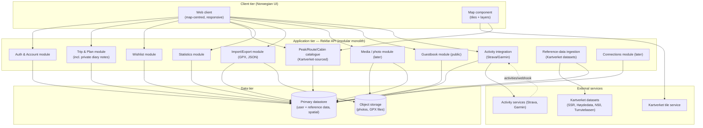
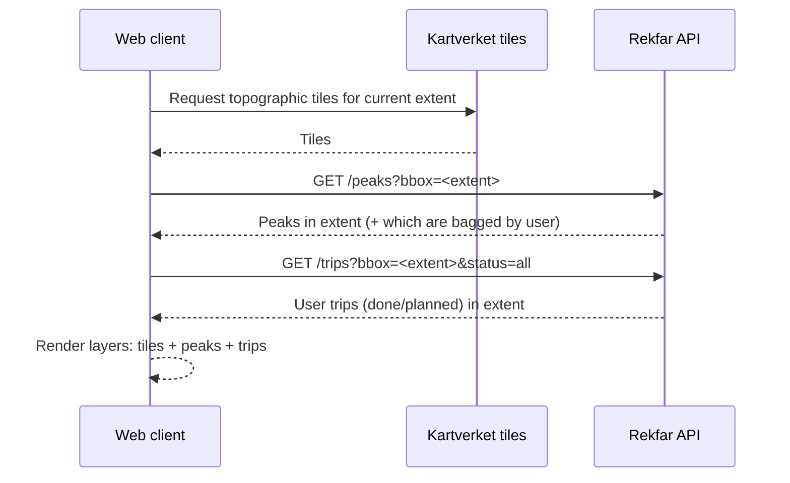
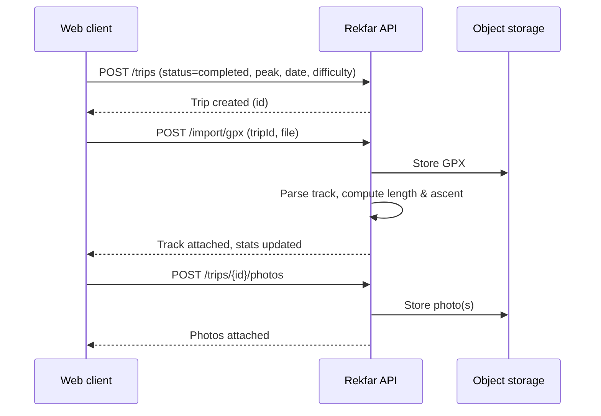

# Application Architecture (TOGAF Phase C — Application)

This describes the **logical application components**, their responsibilities, and
how they interact — independent of the concrete framework, which is deferred
([ADR-0005](../adr/0005-tech-stack-deferred.md)). The guiding principle is *simple
before clever* (P7): a **modular monolith** with a clean API boundary, so a native
client can be added later (P6) without re-architecting.

## 1. Logical component view



## 2. Component responsibilities

| Component | Responsibility |
| --- | --- |
| **Web client** | The Norwegian UI. Renders the map, trip lists, forms, stats. Responsive and mobile-friendly (P10). Internationalised so English can be added later (P5). |
| **Map component** | Loads topographic tiles from Kartverket; draws layers for peaks, trails, and the user's trips (done/planned); handles pan/zoom, extent queries, and marker interaction. Provider abstracted ([ADR-0006](../adr/0006-map-provider-deferred.md)). |
| **Auth & Account** | Registration, login, session/token issuance, profile, privacy settings, account deletion. |
| **Trip & Plan** | CRUD for trips; the `planned → completed` transition; ascent/difficulty/conditions; linking peaks and tracks; **private diary notes (dagboknotat)**. |
| **Wishlist** | Add/remove peaks and trip ideas to a personal wishlist; convert a wishlist item into a planned trip. |
| **Peak/Route/Cabin catalogue** | Query peaks, routes, and **cabins (hytter)** sourced from **Kartverket** (search, by area, within map extent); place detail, including an optional outbound description link when one is known; "have I done this" against the user's history. |
| **Statistics** | Aggregate the user's trips into stats and achievements (peaks bagged, total ascent, per year/region). |
| **Guestbook** | Post and read **public greetings (gjestebok)** on a place (peak/cabin/route); enforce public-vs-private separation; moderation hooks ([ADR-0009](../adr/0009-private-and-public-logbook.md)). |
| **Activity integration** | Connect **Strava/Garmin** via OAuth; ingest activities (webhook/poll); match to peaks/cabins/routes; propose **user-confirmable auto check-ins**; attach tracks ([ADR-0008](../adr/0008-activity-tracking-integrations.md)). |
| **Media / photo** *(later)* | Upload, store (object storage), and serve trip photos; strip/keep EXIF per privacy settings. |
| **Import / Export** | Parse GPX into tracks; produce full JSON export; account data export/delete (P4, P9). |
| **Reference-data ingestion** | Scheduled/admin process that fetches, normalises, and refreshes peaks/routes/cabins/elevation from the **Kartverket** datasets (SSR, Høydedata, N50, Turrutebasen) by bulk download, applies the peak-qualification rule, and reprojects to WGS84 (capability C12, [ADR-0012](../adr/0012-kartverket-primary-source.md)). |
| **Connections** *(later)* | Friends, tagging users on trips, and sharing wishlists with a chosen audience (capability C15, FR-SOCIAL). |

## 3. API boundary

The **Rekfar API** is the single boundary for business logic and user data. The
web client is just one consumer; a future native app is another (P6). Design notes:

- **Style:** A resource-oriented HTTP/JSON API (REST-ish). GraphQL is a possible
  alternative but is not required for this scope — decide alongside the stack.
- **Resources (indicative):**
  `/auth`, `/me`, `/trips`, `/trips/{id}`, `/trips/{id}/notes`, `/plans`, `/wishlist`,
  `/peaks`, `/peaks/{id}`, `/routes`, `/cabins`, `/places/{id}/guestbook`, `/stats`,
  `/connections/{provider}`, `/activities`, `/import/gpx`, `/export`.
- **Spatial queries:** endpoints accept a bounding box / extent for map-driven
  fetching (e.g. `GET /peaks?bbox=...`).
- **Auth:** token/session-based; all user-data endpoints require authentication;
  peak/trail catalogue may allow read-only anonymous access for visitors (A2).
- **Versioning:** version the API from day one (`/v1`) so the native app is not
  broken by web-driven changes.

## 4. Key interactions (sequences)

### 4.1 Load the map with peaks in view



### 4.2 Log a completed trip with a GPX track



### 4.3 Auto-check a summit from a connected activity

```mermaid
sequenceDiagram
    participant S as Strava
    participant A as Activity module
    participant C as Catalogue (Kartverket-sourced)
    participant U as Web client
    S-->>A: Webhook — new activity
    A->>S: Fetch activity + track
    A->>C: Match high point / proximity to peaks & cabins
    C-->>A: Candidate matches
    A-->>U: Propose auto check-in(s)
    U->>A: Confirm (or dismiss)
    A->>A: Create/complete trip; attach track; mark peak bagged
```

## 5. Cross-cutting concerns

- **Internationalisation:** all user-facing strings go through an i18n layer with
  `nb-NO` as the first locale; keys are ready for `en` later (P5).
- **Observability:** minimal but present — structured logs and basic error tracking,
  sized for a hobby project (P1/P7).
- **Security:** standard web hardening (auth, input validation, rate limiting on
  public endpoints, secure secrets handling); private-by-default data access checks.
- **Caching:** cache reference data and, where permitted, map tiles; cache stats.
- **Integrations:** external providers (Kartverket data sources, Strava, Garmin) sit behind
  provider-agnostic interfaces; the app degrades gracefully when they are unavailable
  (NFR-INTEG); OAuth secrets are handled securely and never committed.
- **Testing:** favour tests around the domain logic (trip status transitions,
  ascent/stat computation, GPX parsing) since that is where correctness matters.

## 6. Deployment shape (logical)

A single deployable application (the modular monolith) plus a primary datastore and
object storage. This can run on a modest managed platform or a single small VM
(sized for cost — P1). Splitting the ingestion job into a scheduled task/worker is
the only likely early separation. Concrete hosting is covered in the
[technology architecture](05-technology-architecture.md).
