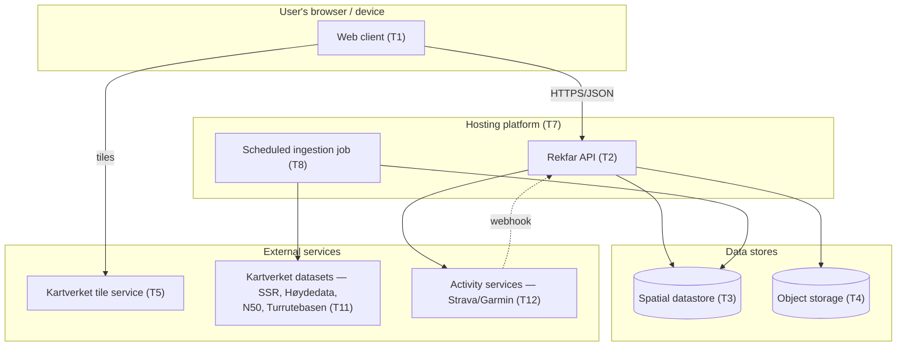

# Technology Architecture (TOGAF Phase D)

This describes the **technology building blocks** — the platform, hosting, and
infrastructure — needed to realise the [application architecture](04-application-architecture.md).
The concrete framework and map provider are **deferred**
([ADR-0005](../adr/0005-tech-stack-deferred.md),
[ADR-0006](../adr/0006-map-provider-deferred.md)); this document defines the
**building blocks and the criteria** for choosing them, and lists credible
candidates, without committing.

## 1. Technology building blocks

| # | Building block | Role | Deferred? |
| --- | --- | --- | --- |
| T1 | Web client runtime | Renders the Norwegian UI in the browser | Framework deferred (ADR-0005) |
| T2 | Application/API runtime | Hosts the Rekfar API (modular monolith) | Deferred |
| T3 | Primary datastore | Stores user + reference data with **spatial** support | Engine deferred; capability required |
| T4 | Object storage | Stores photos and GPX files | Deferred |
| T5 | Map tiles + rendering | Topographic base map + vector overlays | Provider deferred (ADR-0006) |
| T6 | Geospatial libraries | GPX parsing, geometry, coordinate transforms, ascent calc | Deferred |
| T7 | Hosting / platform | Where T1–T4 run | Deferred |
| T8 | CI/CD & source control | Build, test, deploy | GitHub (chosen for the repo) |
| T9 | Auth mechanism | Sessions/tokens, password or OAuth login | Deferred |
| T10 | Observability | Logs + basic error tracking | Deferred |
| T11 | Kartverket reference-data integration | Source core places (peaks/routes/cabins) + elevation | Datasets chosen (ADR-0012); refresh cadence open |
| T12 | Activity-service integration | OAuth + webhooks/polling for Strava (later Garmin) | Provider(s) deferred (ADR-0008) |

## 2. Selection criteria (how we will decide)

Every technology choice is judged against the [principles](principles.md), especially:

1. **Cost (P1):** Has a genuinely free or near-free tier at hobby scale.
2. **Single-maintainer operability (P1/P7):** Little ops burden; managed where possible.
3. **Spatial capability (data arch §5):** First-class geospatial queries and geometry.
4. **Longevity & ecosystem:** Mature, well-documented, unlikely to disappear.
5. **Native-app friendliness (P6):** API-first; ideally shares language/skills with a
   future mobile client.
6. **Portability (P4):** No lock-in that would trap user data.

## 3. Candidate options (illustrative, non-binding)

> These are examples to make the criteria concrete. The actual decision is recorded
> when made; see the deferred ADRs.

### T1/T2 — Web client & API framework

| Candidate | Notes |
| --- | --- |
| Next.js (React, TypeScript) | Full-stack in one framework; large ecosystem; clean path to React Native for T-later native app (P6). |
| SvelteKit (TypeScript) | Lightweight, excellent DX, small bundles; smaller shared-native story. |
| React + Vite SPA + separate API (Node/TS, or Python/FastAPI, or Go) | Clear client/API split; more moving parts. |

### T3 — Primary datastore (must be spatial)

| Candidate | Notes |
| --- | --- |
| PostgreSQL + PostGIS | The reference choice for geospatial; free; available as managed free/cheap tiers. Strong fit. |
| SQLite + SpatiaLite | Simplest/cheapest; good for a single-node hobby app; fewer managed options. |
| A managed Postgres (e.g. with PostGIS enabled) | Removes ops burden; watch free-tier limits. |

### T4 — Object storage

| Candidate | Notes |
| --- | --- |
| S3-compatible object storage (various providers, free tiers) | Standard for photos/GPX; keep only references in T3. |
| Local disk / volume (single VM) | Cheapest; needs backup discipline. |

### T5 — Map tiles + rendering

| Candidate | Notes |
| --- | --- |
| Kartverket topographic tiles + **MapLibre GL** | Free official Norwegian tiles + open-source renderer; no vendor lock-in. Strong fit with P1/P3. |
| Kartverket tiles + **Leaflet** | Simpler, raster-friendly, huge plugin ecosystem. |
| Mapbox / MapTiler | Polished, commercial; free tiers exist but adds a paid dependency (weigh against P1). |

### T6 — Geospatial libraries

GPX parsing, GeoJSON handling, distance/ascent computation, and EPSG transforms
(4326 ↔ 25832–25835 ↔ 3857). Mature libraries exist in every candidate language;
choose alongside T1/T2.

### T7 — Hosting

| Candidate | Notes |
| --- | --- |
| Managed app platform with free tier (e.g. a PaaS) + managed Postgres | Lowest ops; watch cold starts and free-tier caps. |
| Single small VM running the monolith + Postgres + storage | Most control, predictable low cost; you run the ops. |
| Static hosting for client + serverless functions for API | Cheap at rest; verify spatial DB access and cold-start behaviour. |

### T8 — CI/CD & source control

**GitHub** hosts the repository (chosen). GitHub Actions is the natural CI/CD for
build/test/deploy and can also schedule the reference-data ingestion job (T-cron).

### T9 — Auth

Email+password with proper hashing, or OAuth via a provider, or a managed auth
service with a free tier. Must support account deletion/export (P9/P4).

### T11 — Kartverket reference-data integration

Ingest four **Kartverket** datasets by scheduled bulk download into our own store: **SSR**
for peak names and coordinates (also available live at `ws.geonorge.no/stedsnavn/v1/`,
no API key), **Høydedata (DTM)** for elevation sampling, **N50 `Turisthytte`** for cabins,
and **Turrutebasen** for routes and `Ruteinfopunkt`. Each record keeps its Kartverket
identifier, source dataset, and fetch date; geometry is reprojected from ETRS89/UTM to
WGS84 at ingestion. The open sub-decision is the **refresh cadence and delta handling** per
dataset — see [ADR-0012](../adr/0012-kartverket-primary-source.md).

### T12 — Activity-service integration

**Strava API** first — OAuth for account connection and **webhooks** for new-activity
push (polling as a fallback); **Garmin Connect** later (access is gated). Sits behind a
provider-agnostic interface, with a background worker for ingestion and matching. See
[ADR-0008](../adr/0008-activity-tracking-integrations.md).

## 4. Target technology view (abstract)

## 5. Non-functional technology implications

- **Availability:** Hobby-grade; no HA requirement. A single region/instance is fine.
- **Backups:** Automated backups of T3 (user data) are **mandatory** even at hobby
  scale (P4). Reference data is rebuildable.
- **Scaling:** Expected load is tiny (personal/small user base); optimise for cost at
  rest, not for scale.
- **Security/TLS:** HTTPS everywhere; secrets in the platform's secret store, never in
  the repo (see `.gitignore`).
- **Compliance:** Data hosted in a way consistent with GDPR for Norwegian/EEA users;
  prefer EEA regions.

## 6. Open technology decisions

Tracked as deferred ADRs and in the [roadmap](06-roadmap.md):

- **T1/T2 framework** — [ADR-0005](../adr/0005-tech-stack-deferred.md).
- **T5 map provider/renderer** — [ADR-0006](../adr/0006-map-provider-deferred.md).
- **T11 Kartverket refresh cadence & delta handling** — [ADR-0012](../adr/0012-kartverket-primary-source.md).
- **T12 activity providers** (Strava first, Garmin later) — [ADR-0008](../adr/0008-activity-tracking-integrations.md).
- **T3 exact engine/host, T7 hosting, T9 auth** — to be recorded when chosen.
