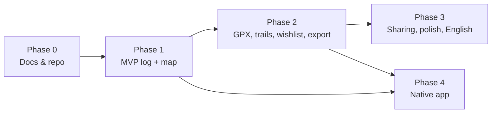

# Roadmap — Opportunities, Solutions & Migration (TOGAF Phases E/F)

This turns the architecture into a **phased plan**. For a hobby project the "migration
plan" is simply the order in which we build things, plus the risks to watch. Phases
are deliberately small and shippable.

## Guiding idea

Ship the smallest thing that is genuinely useful — a private, map-centred log of
Norwegian summit trips — then grow it. Each phase should leave a working product.

## Phase 0 — Foundations (this repository)

**Goal:** Documentation, scope, and decisions in place.

- TOGAF-based docs (vision, business, data, application, technology).
- Glossary, requirements, use cases.
- ADRs, including deferred decisions (stack, map provider).
- Repository initialised on GitHub.

**Exit:** A contributor can understand the project and start building. ✅ (in progress)

## Phase 1 — MVP: personal summit log on a map

**Goal:** One user can log and plan trips and see them on a Norwegian map.

Scope:

- Account: register, log in, profile, privacy default = private (FR-ACC).
- Map: Kartverket topographic base map, pan/zoom (FR-MAP).
- Peak catalogue: Norwegian **mountain tops (fjelltopper)** sourced from **Kartverket**
  (SSR names/coordinates + DTM-derived elevation), each with a stable Kartverket
  identifier, searchable and shown on the map (FR-PEAK, FR-REF). Seeded by an initial
  import, with the peak-qualification rule decided first
  ([ADR-0012](../adr/0012-kartverket-primary-source.md)).
- Trip logging: create a completed **summit trip (topptur)** with date, peak, ascent,
  difficulty, and **private diary notes (dagboknotat)** (FR-LOG, FR-BOOK-1). Photos are
  deferred to Phase 2.
- Trip planning: create a **planned trip** and see it on the map in a distinct style;
  convert planned → completed (FR-PLAN).
- Basic stats: peaks bagged, total ascent, trips this year (FR-STAT).
- Norwegian UI throughout; i18n scaffolding in place (P5).

**Explicitly deferred in MVP:** photos, activity-service integrations (Strava/Garmin),
public guestbook, GPX import, achievements, social/friends, native app.

**Exit / success:** the [definition of success](01-architecture-vision.md#9-definition-of-success-for-the-mvp).

## Phase 2 — Richer logging & data

**Goal:** Make the log fuller and the data better.

- **GPX import** for tracks; auto-compute length and ascent from the track (FR-DATA).
- **Activity-service integration — Strava (primary):** connect via OAuth, import
  activities, and propose **auto check-ins (automatisk avkryssing)** of peaks/cabins/
  routes with the track attached (FR-ACT, [ADR-0008](../adr/0008-activity-tracking-integrations.md)).
- **Cabins (hytter)** as reference places and trip waypoints from **N50 `Turisthytte`**,
  with trailheads and parking from Turrutebasen `Ruteinfopunkt` (FR-REF-9).
- **Public guestbook (gjestebok):** post and view greetings on summit/cabin/route pages
  (FR-BOOK-3..6, [ADR-0009](../adr/0009-private-and-public-logbook.md)).
- **Trails/routes layer** from **Turrutebasen** on the map (FR-MAP).
- Elevation profile for a trip using Kartverket Høydedata.
- **Photo upload** — one or more photos per trip (FR-LOG-5), deferred from the MVP;
  richer trip detail pages.
- **Wishlist / bucket list** of peaks (FR-PLAN); "peaks near me / in this area".
- Full **data export** (JSON) and account deletion (FR-DATA, P4/P9).
- Achievements / milestones (FR-STAT, capability C8).

## Phase 3 — Polish, sharing, and reach

**Goal:** Make it pleasant to share and to use everywhere.

- Optional **per-trip sharing** via link; optional public profile (capability C11, P9).
- **Connections between users (later stage):** friends (**venner**), **tagging**
  (merke/tagge) users on a trip, and **sharing a wishlist (ønskeliste)** (FR-SOCIAL).
  Kept optional and privacy-controlled so the app stays a personal log first (P9).
- **Additional activity services** (e.g. **Garmin**) behind the same integration
  interface (FR-ACT-6).
- Better statistics and visualisations (per region *kommune/fjellområde*, over time).
- Performance, accessibility (WCAG 2.1 AA target, P10), and PWA/offline-friendly map.
- Optional **English UI** switched on via the i18n layer (P5).

## Phase 4 — Native app (optional, later)

**Goal:** A native mobile app reusing the existing API (P6).

- Native client (e.g. React Native if the web stack is React) consuming the same
  `/v1` API.
- On-device features that make sense on mobile: live GPS **track recording (sporing)**,
  offline map areas, quick "log this summit now".
- See [ADR-0004](../adr/0004-web-first-native-later.md).

## Dependency overview

## Risks & watch-items

| Risk | Impact | Mitigation |
| --- | --- | --- |
| **Open-data licence/terms change** (Kartverket) | Could break map/peak/trail data | Confirm terms before building; keep sources swappable; cache where permitted; attribute correctly (P3). |
| **Kartverket dataset schema or distribution change** | Ingestion could break between refreshes | Reference data is a rebuildable local copy, so runtime is unaffected while we adapt ([ADR-0012](../adr/0012-kartverket-primary-source.md)); pin the product-specification version we parse against. |
| **No curated trip descriptions in the source** | Place pages are thinner than a portal like UT.no | Lean on Rekfar's own content — private diary and public guestbook ([ADR-0009](../adr/0009-private-and-public-logbook.md)) — and on the optional outbound description link (FR-REF-7). |
| **Activity-integration API terms / limits** (Strava, Garmin) | Auto check-in could break or be rate-limited; Garmin access is gated | Keep integrations optional and abstracted ([ADR-0008](../adr/0008-activity-tracking-integrations.md)); manual + GPX logging always works; respect terms and non-commercial conditions. |
| **Public guestbook abuse/spam** | User-generated public content could be misused | Light moderation, reporting/removal, and basic spam protection ([ADR-0009](../adr/0009-private-and-public-logbook.md)); keep private data separate. |
| **Defining "a peak"** (which points count as `fjelltopp`) — now an **MVP decision**, since no curated upstream makes it for us | Catalogue quality; blocks the Phase 1 seed | Pick a `navneobjekttype` set from SSR plus an elevation/prominence threshold; **document and version the rule** (FR-REF-11); allow manual curation on top. |
| **Free-tier hosting limits** | Downtime or forced migration | Keep the app portable (P4/P7); avoid provider-specific lock-in; automate backups. |
| **Scope creep toward a social network** | Distracts from the core log | Keep sharing minimal and late (Phase 3); the product is a personal logbook first. |
| **Single-maintainer bandwidth** | Slow or stalled progress | Small shippable phases; good docs so it is easy to resume. |

## What to decide next

1. Resolve **[ADR-0005 (tech stack)](../adr/0005-tech-stack-deferred.md)** — this
   unblocks all of Phase 1.
2. Resolve **[ADR-0006 (map provider/renderer)](../adr/0006-map-provider-deferred.md)**.
3. Confirm the **data-source terms** for Kartverket tiles and for the four Kartverket
   reference datasets before MVP (all expected to be CC BY 4.0).
4. Decide the **"what counts as a peak"** rule for the seed catalogue (FR-REF-11) — this
   now blocks the Phase 1 peak catalogue.
5. Close the remaining **ingestion questions** in
   [ADR-0012](../adr/0012-kartverket-primary-source.md): refresh cadence and delta
   handling per dataset, Turrutebasen access path, and coordinate reprojection.
