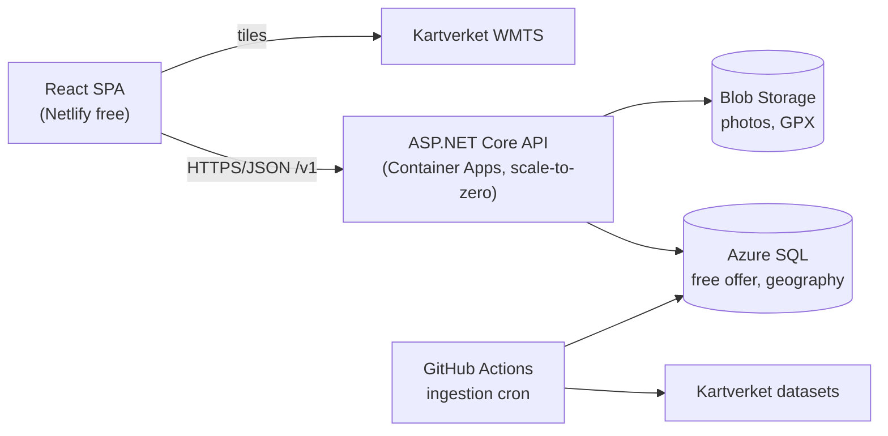
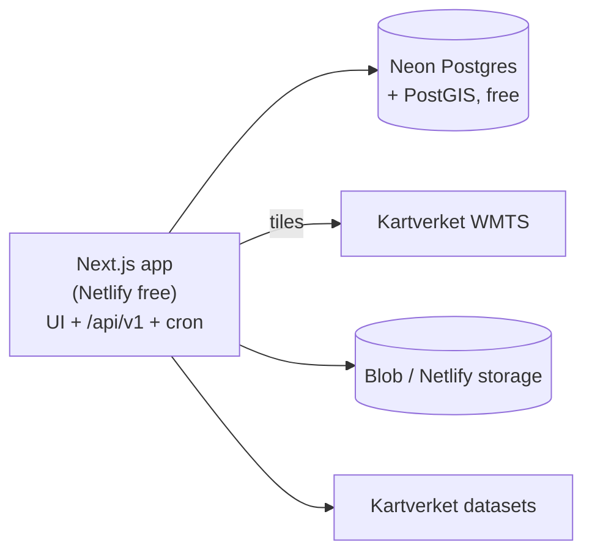
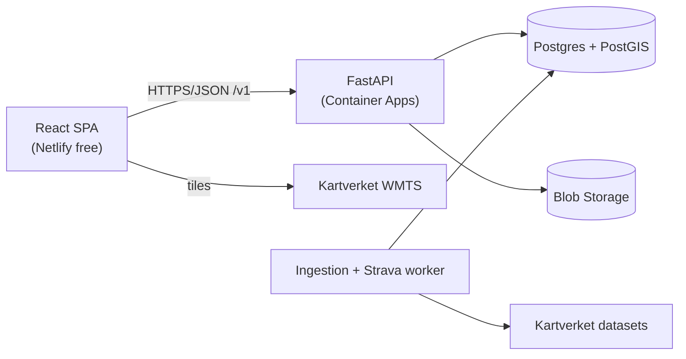

# Technology Stack Options

**Status:** Input document for [ADR-0005](../adr/0005-tech-stack-deferred.md) and
[ADR-0006](../adr/0006-map-provider-deferred.md). Not a decision.

This document turns the abstract building blocks T1–T12 in the
[technology architecture](05-technology-architecture.md) into **three concrete,
buildable stacks**, and compares them against the selection criteria so
[ADR-0005](../adr/0005-tech-stack-deferred.md) can be resolved. Resolving it unblocks
all of roadmap [Phase 1](06-roadmap.md).

## 1. Inputs to the shortlist

Two sets of inputs shaped these three options.

**From the architecture** — the six selection criteria in
[technology architecture §2](05-technology-architecture.md#2-selection-criteria-how-we-will-decide):
cost (P1), single-maintainer operability (P1/P7), spatial capability, longevity,
native-app friendliness (P6), and portability (P4).

**From the maintainer** — stated as preferences, not requirements:

| Preference | Weight |
| --- | --- |
| Fluent in .NET, Java, Python, JavaScript | Strong signal — [P7](principles.md#p7-simple-before-clever) and the *single-maintainer bandwidth* risk make familiarity a first-class architectural concern, not a nicety. |
| Comfortable with SQL databases (MSSQL, MySQL); no hands-on document-database experience | Rules document stores out of the MVP. All three options below are relational. |
| Prefers Azure over AWS/GCP | Applied as a default, not a constraint. Where Azure's own free tiers are weak, this document says so. |
| Has a Netlify account, usable for a first prototype | Treated as the **client hosting** target for the prototype in every option. Netlify cannot host the API in options A and C (see §2.3). |

## 2. What is the same in all three options

These choices are stable across the options, so they are not decision drivers. They
are recorded here so each option below can be read as *only* the parts that differ.

### 2.1 Map tiles and renderer (T5) — settles ADR-0006

**Kartverket topographic tiles + MapLibre GL**, in all three options.

Kartverket's free products are published under **CC BY 4.0**, explicitly for
commercial *and* non-commercial use, requiring attribution as "©Kartverket" with a
link. Their cache/WMS services carry technical limits (the topographic cache serves
roughly zoom levels 12–20). No API key or registration is documented for the open
services. This is as clean a fit with [P1](principles.md#p1-hobby-first-cost-minimal)
and [P3](principles.md#p3-open-data-over-proprietary-data) as the project will find,
and the renderer choice is independent of the backend language — so
[ADR-0006](../adr/0006-map-provider-deferred.md) can be accepted now regardless of
which option below wins.

> **Confirm before MVP:** the tile URL template, the zoom-level range actually served,
> and whether caching tiles is permitted. This is already a roadmap watch-item.

### 2.2 Other constants

| Block | Choice | Why |
| --- | --- | --- |
| T4 — Object storage | **Azure Blob Storage** (Cool/Hot, EEA region) | Cents per month at hobby volume; S3-compatible tooling exists; no lock-in on the data itself (photos and GPX are plain files). |
| T8 — CI/CD | **GitHub Actions** | Already chosen; also runs the scheduled Kartverket ingestion job. |
| T10 — Observability | Structured logs + a free error-tracking tier | Sized for [P1](principles.md#p1-hobby-first-cost-minimal). |
| T11 — Kartverket reference data | **SSR** REST/JSON (`ws.geonorge.no/stedsnavn/v1/`, no key) + Geonorge bulk downloads for **N50** and **Turrutebasen** + **Høydedata** for elevation | Per [ADR-0012](../adr/0012-kartverket-primary-source.md). Plain HTTP and file parsing — language-agnostic, no influence on this decision. |
| T12 — Strava | OAuth + webhooks, provider-agnostic interface | Per [ADR-0008](../adr/0008-activity-tracking-integrations.md). |
| Region | An **EEA region** (Sweden Central / West Europe; Norway East where the service offers it) | GDPR posture per [P9](principles.md#p9-privacy-by-default). |

### 2.3 What Netlify can and cannot do here

Netlify's Free plan currently provides 100 GB bandwidth, 300 build minutes,
125,000 function invocations, 1 million edge-function invocations, and 10 GB storage
per month — comfortably above anything this project will generate. Two limits matter
architecturally:

- Netlify Functions run **JavaScript/TypeScript** (and Deno at the edge). They cannot
  host a .NET or Python API. In options **A** and **C**, Netlify hosts the **client
  only** and the API lives on Azure — which means CORS and a second deploy target.
- Netlify does not provide the database. Every option needs a datastore elsewhere.

Only option **B** can run client *and* API on Netlify as a single deployment.

## 3. The cost finding that shapes the datastore choice

This is the single most decision-relevant fact uncovered while preparing this
document, because [P1](principles.md#p1-hobby-first-cost-minimal) is the project's
hardest constraint:

> **Azure's own managed PostgreSQL has no perpetual free tier.** Azure Database for
> PostgreSQL Flexible Server is priced per-hour from the B1ms burstable tier upward;
> free access comes only via time-limited new-account offers. Running PostGIS on
> first-party Azure is therefore a **recurring monthly bill**, modest but real, for
> the life of the project.
>
> **Azure SQL Database, by contrast, has a perpetual free offer**: 100,000 vCore
> seconds of serverless compute, 32 GB data and 32 GB backup storage per database per
> month, up to 10 databases per subscription, renewing every calendar month for the
> lifetime of the subscription — not for 12 months. When the monthly allowance is
> exhausted the database auto-pauses until the next month (the default), or you can
> opt into paid overage.

So on Azure the honest choice is: **free-forever relational storage means Azure SQL**,
and **PostGIS means either paying Azure monthly or hosting Postgres off-Azure** (Neon's
Free plan — 0.5 GB storage and 100 compute-hours per project, scale-to-zero after five
minutes — is available as an Azure Native Integration, which keeps provisioning and
billing inside Azure even though the database itself is Neon's).

The rest of this document is largely the consequences of that trade.

---

## 4. Option A — .NET on Azure with Azure SQL spatial

*"Build it in the language you are strongest in, on the only genuinely free-forever
database Azure offers."*

### Components

| Block | Choice |
| --- | --- |
| T1 — Web client | **React + Vite + TypeScript** SPA, i18n via `react-i18next` (`nb-NO` first) |
| T2 — API | **ASP.NET Core Minimal APIs** (.NET, C#), modular monolith, OpenAPI-generated |
| T3 — Datastore | **Azure SQL Database**, free offer, `geography` columns + spatial indexes; **EF Core + NetTopologySuite** |
| T6 — Geospatial libs | NetTopologySuite (geometry), ProjNet (EPSG transforms), a GPX parser |
| T7 — Hosting | API on **Azure Container Apps** (consumption; scale-to-zero); client on **Netlify** for the prototype, optionally **Azure Static Web Apps** later |
| T9 — Auth | ASP.NET Core Identity (email + password) with cookie/JWT; OAuth provider addable |
| Native later | .NET MAUI, or React Native reusing the React skills |

Azure Container Apps' consumption plan includes a monthly free grant of 180,000
vCPU-seconds, 360,000 GiB-seconds and 2 million requests per subscription, and
supports scaling to zero with no charge while scaled down — which covers a hobby API's
entire usage.

### Strengths

- **Lowest execution risk.** C# is the maintainer's strongest language and SQL Server
  is a familiar database. Against the roadmap's *single-maintainer bandwidth* risk,
  that is worth more than any framework's elegance.
- **Genuinely free forever**, not free-for-12-months — the only option here that is
  true of on first-party Azure.
- **Clean API boundary by construction.** A separate ASP.NET Core project makes the
  `/v1` contract in [application architecture §3](04-application-architecture.md#3-api-boundary)
  the default shape rather than something to maintain discipline about ([P6](principles.md#p6-web-first-but-do-not-paint-the-mobile-app-into-a-corner)).
- **Strong typing end-to-end**, and OpenAPI generates a typed client for the web app
  today and a native app later.

### Weaknesses and honest caveats

- **SQL Server spatial is capable but thinner than PostGIS.** It has `geography`,
  `STDistance`, `STIntersects`, `STBuffer` and spatial indexes — everything the
  documented queries actually need (peaks within a bounding box, matching a track to
  nearby summits, storing a route `LineString`). What it lacks: **no in-database
  coordinate transformation** (no `ST_Transform` equivalent), a much smaller ecosystem
  of geospatial tooling, and fewer analytical functions. Mitigation: store everything
  in EPSG:4326 and do the EPSG:25832–25835 conversions in application code with
  ProjNet; the data architecture already treats 4326 as the storage CRS.
- **Serverless auto-pause means cold starts.** A free-tier database that has been idle
  resumes on first query, which can take tens of seconds. For a map app someone opens
  twice a week, the first page load after an idle period will be slow. Mitigations:
  tune the auto-pause delay, keep a cheap warm-up ping, or accept it — but do not
  discover it during a demo.
- **Two deploy targets** (Netlify client + Azure API) means CORS setup and two
  pipelines.

### Cost

Effectively **0 NOK/month**: Azure SQL free offer + Container Apps free grant +
Netlify free + a few cents of Blob Storage.

---

## 5. Option B — Next.js full-stack on Netlify with Neon PostGIS

*"One language, one repository, one `git push` — the fastest route to something you
can actually use."*

### Components

| Block | Choice |
| --- | --- |
| T1+T2 — Client and API | **Next.js (React, TypeScript)**, App Router; route handlers under `/api/v1`; `next-intl` for `nb-NO` |
| T3 — Datastore | **PostgreSQL + PostGIS on Neon** (Free plan, scale-to-zero), provisioned through Azure Native Integration; **Drizzle** or **Prisma** with raw SQL for spatial predicates |
| T6 — Geospatial libs | Turf.js, proj4js, a GPX parser — plus PostGIS doing the heavy work server-side |
| T7 — Hosting | **Netlify** (already have the account) for client, API routes, and the scheduled ingestion function |
| T9 — Auth | Auth.js (NextAuth) with email + OAuth |
| Native later | React Native — the strongest shared-code story of the three |

This is the combination the architecture already names as its leading non-binding
candidate in [ADR-0005](../adr/0005-tech-stack-deferred.md).

### Strengths

- **Fastest to a working prototype.** One repository, one deploy, preview URLs per
  branch, and the Netlify account is already in hand. Weeks, not months, to a map with
  peaks and a log form on it.
- **PostGIS is the reference geospatial engine.** Everything the project might ever
  want — `ST_Transform`, `ST_Simplify`, `ST_DWithin`, geography and geometry types,
  raster if it ever mattered — is there and well documented.
- **Best native-app path.** React on the web plus React Native on mobile shares
  components, types, and idioms.
- **One language** across the whole stack reduces context-switching for a solo
  maintainer.

### Weaknesses and honest caveats

- **Furthest from the maintainer's core strengths.** JavaScript is on the list, but
  modern Next.js — server components, the server/client boundary, caching semantics —
  is a substantial learning surface, and it is exactly the kind of surface that stalls
  hobby projects. This is the option most likely to be enjoyable *and* the one most
  likely to consume evenings on framework behaviour rather than on Rekfar.
- **Neon's free storage is 0.5 GB per project, and that is a real ceiling here.** Peak
  and cabin points are tiny, but the *route geometry* from Turrutebasen for Norway is
  not: stored naively as full-resolution `LineString`s it can
  approach or exceed that budget. Mitigations: simplify geometries on ingest, store
  only routes near logged trips at first, or move to a paid tier. Worth measuring
  before committing.
- **Full-stack Next.js erodes the API boundary.** It is very easy to call the database
  directly from a server component and end up with business logic that a future native
  app cannot reach — precisely what [P6](principles.md#p6-web-first-but-do-not-paint-the-mobile-app-into-a-corner)
  is meant to prevent. It is avoidable with discipline (a `core/` module that route
  handlers are thin wrappers over), but it is discipline rather than structure.
- **Least aligned with the Azure preference.** Hosting is Netlify and the database is
  Neon; Azure's role is reduced to provisioning and billing.

### Cost

Effectively **0 NOK/month** on Netlify Free + Neon Free — until the route-geometry
volume forces a Neon upgrade.

---

## 6. Option C — Python FastAPI with PostGIS

*"Optimise for the genuinely hard part: turning GPS tracks into confident summit
check-ins."*

### Components

| Block | Choice |
| --- | --- |
| T1 — Web client | **React + Vite + TypeScript** SPA (identical to option A) |
| T2 — API | **FastAPI** (Python), modular monolith, OpenAPI-native; SQLAlchemy + GeoAlchemy2 |
| T3 — Datastore | **PostgreSQL + PostGIS** — Neon Free, or Azure Database for PostgreSQL B1ms if the monthly cost is accepted |
| T6 — Geospatial libs | Shapely, pyproj, GeoPandas, gpxpy, rasterio — the strongest geospatial ecosystem in any language |
| T7 — Hosting | API on **Azure Container Apps**; client on **Netlify** |
| T9 — Auth | FastAPI-Users or a hand-rolled JWT/session layer |
| Native later | React Native (shares nothing with the API, but the OpenAPI contract is excellent) |

### Strengths

- **Best fit for the domain's hard problems.** The auto check-in flow in
  [application architecture §4.3](04-application-architecture.md#43-auto-check-a-summit-from-a-connected-activity)
  — take a Strava track, reproject it, find its high point, match against a peak
  catalogue with a tolerance, compute smoothed ascent — is a few dozen lines with
  Shapely and pyproj, and a genuine slog elsewhere. GPX parsing, elevation profiles and
  EPSG transforms are all one import away.
- **Cleanest API contract.** FastAPI generates OpenAPI from type hints as a side effect
  of writing the code, so the web client and a future native client both get generated,
  typed clients for free.
- **PostGIS**, with the same advantages as option B.
- Python is well suited to the scheduled ingestion and reconciliation jobs, which are a
  standing part of this project rather than a one-off.

### Weaknesses and honest caveats

- **Slowest to a first prototype** — three moving pieces to stand up (SPA, API,
  database) before anything appears on screen.
- **Two languages** to maintain alone, and Python's typing story, while much improved,
  is weaker than C#'s or TypeScript's for refactoring confidence over years.
- **Inherits option B's PostGIS cost problem** — either Neon's 0.5 GB free ceiling or
  a small recurring Azure bill.
- The strongest argument for this option only pays off in **Phase 2**, when Strava
  integration and GPX arrive. It is a bet on future difficulty, paid for now.

### Cost

**0 NOK/month** on Neon Free + Container Apps free grant + Netlify Free, or roughly a
low-double-digit-USD monthly bill if Azure's managed PostgreSQL is used instead.

---

## 7. Side-by-side

Scale: **Strong** · **Good** · **Adequate** · **Weak**.

| Criterion | A — .NET + Azure SQL | B — Next.js + Neon | C — FastAPI + PostGIS |
| --- | --- | --- | --- |
| 1. Cost at hobby scale (P1) | **Strong** — perpetual free, no ceiling in sight | Good — free until route geometry fills 0.5 GB | Good — same ceiling, or a small bill |
| 2. Single-maintainer operability (P1/P7) | Good — two deploy targets, both managed | **Strong** — one deploy | Adequate — three pieces |
| 3. Spatial capability | Adequate — covers the documented queries; no in-DB reprojection | **Strong** — PostGIS | **Strong** — PostGIS + Python geo stack |
| 4. Longevity & ecosystem | **Strong** | Good — fastest-moving, most churn | **Strong** |
| 5. Native-app friendliness (P6) | **Strong** — API boundary is structural | Adequate — boundary needs discipline | **Strong** — OpenAPI-native |
| 6. Portability (P4) | Good — containerised; SQL Server is the least portable piece | Good — Postgres is portable; Netlify adapter is not | **Strong** |
| Maintainer familiarity | **Strong** | Adequate | Good |
| Time to first prototype | Good | **Strong** | Adequate |
| Honours the Azure preference | **Strong** | Weak | Good |

## 8. Recommendation

**Option A**, with option B's prototype speed borrowed rather than discarded.

The reasoning is not that .NET is better than Next.js or FastAPI. It is that this
project's two binding constraints are **money** and **the maintainer's evenings**, and
option A is the only one that is unambiguously strongest on both. The roadmap's own
risk register names *single-maintainer bandwidth* as a live risk and
[P7](principles.md#p7-simple-before-clever) makes simplicity a principle; for a solo
hobby project, "the language I think in" is a legitimate architectural input, and here
it coincides with the only perpetually free database on the preferred cloud.

The case against A is the spatial gap, and it is smaller than it first looks. The
queries this application actually issues — peaks within the current map extent, peaks
within *n* metres of a track's high point, store and redraw a route line — are all
well within `geography`'s range. What PostGIS would buy is reprojection and analysis
that the data architecture has already decided to do in EPSG:4326 anyway.

Two things make this recommendation reversible, which matters more than getting it
right first time:

1. **Use NetTopologySuite types in the domain layer**, not raw SQL Server geography.
   NTS is the same geometry model Npgsql uses for PostGIS, so a later migration is a
   provider swap plus a data migration rather than a rewrite — this is
   [P4](principles.md#p4-user-owns-their-data) applied to the schema.
2. **Keep the client a plain React SPA on Netlify.** The maintainer's Netlify account
   gets used from day one, the prototype ships fast, and if the backend ever changes
   language the client is untouched.

**Take option B instead if** getting something on screen in the next two weekends
matters more than anything else, and the intention is to learn modern React properly
along the way. **Take option C instead if** the Strava auto-check-in feature is the
part that excites you most and you want the tooling that makes it easy — accepting a
slower start and a small monthly bill.

The trade-off, stated plainly: **A costs a few extra weeks up front and pays back in
years of low friction; B costs nothing up front and risks a rewrite at the API boundary
when the native app arrives; C costs the most up front and pays back only if Phase 2's
track-matching turns out to be the hard part.**

## 9. Also considered, and why not

| Considered | Why not now |
| --- | --- |
| **Java + Spring Boot + Hibernate Spatial** | Entirely credible and the maintainer knows Java. Rejected because JVM memory and start-up cost sit badly with scale-to-zero free grants, and it offers nothing option A does not, at more ceremony. |
| **Blazor (WASM or Server) instead of React** | Attractive for staying in one language. Rejected because the map is the product: MapLibre GL is a JavaScript library, and driving it through JS interop from Blazor adds friction to the single most important component. Blazor Server also conflicts with scale-to-zero. |
| **Azure Cosmos DB** | A document database, which the maintainer has no operational experience with, and its geospatial support is weaker than either relational option. Contradicts [P7](principles.md#p7-simple-before-clever). |
| **MySQL** | Familiar, and it does have spatial types, but its spatial function coverage and index behaviour lag both SQL Server and PostGIS, and it has no comparable free tier on Azure. |
| **SQLite + SpatiaLite** | Genuinely the cheapest and simplest, and a reasonable fallback. Rejected because it pins the app to a single instance with a persistent volume, which undoes the scale-to-zero cost model and complicates backups — a mandatory requirement per [technology architecture §5](05-technology-architecture.md#5-non-functional-technology-implications). |
| **Mapbox / MapTiler** | Polished, but a paid dependency and a lock-in risk against [P1](principles.md#p1-hobby-first-cost-minimal) and [P3](principles.md#p3-open-data-over-proprietary-data) when Kartverket + MapLibre is free and authoritative. |
| **GraphQL instead of REST** | No requirement in scope justifies it; [application architecture §3](04-application-architecture.md#3-api-boundary) already leans REST-ish. |

## 10. What to confirm before accepting ADR-0005

1. **Measure the route-geometry volume** from Turrutebasen at
   full and simplified resolution. This decides whether Neon's 0.5 GB free ceiling is a
   real constraint, and it is the one number that could flip the recommendation.
2. **Test the Azure SQL free-tier resume time** from auto-pause with a realistic
   spatial query, and decide whether it is acceptable for the first page load.
3. **Confirm Kartverket's tile URL template, zoom range, and caching terms** — a
   standing roadmap watch-item, and a prerequisite for
   [ADR-0006](../adr/0006-map-provider-deferred.md).
4. **Confirm the Kartverket dataset access paths** (SSR API and download, N50 and
   Turrutebasen downloads, Høydedata) and the refresh/delta mechanism per dataset, per the
   open questions in [ADR-0012](../adr/0012-kartverket-primary-source.md).
5. **Confirm the EEA region** available for each chosen service.

## 11. Sources

- Azure SQL Database free offer — <https://learn.microsoft.com/en-us/azure/azure-sql/database/free-offer>
- Azure Container Apps pricing and free grant — <https://azure.microsoft.com/en-us/pricing/details/container-apps/>
- Azure Database for PostgreSQL Flexible Server pricing — <https://azure.microsoft.com/en-us/pricing/details/postgresql/flexible-server/>
- Azure Static Web Apps plans — <https://learn.microsoft.com/en-us/azure/static-web-apps/plans>
- Netlify Free plan — <https://www.netlify.com/blog/introducing-netlify-free-plan/>
- Neon pricing (Free plan) — <https://neon.com/pricing>
- Neon as an Azure Native Integration — <https://learn.microsoft.com/en-us/azure/partner-solutions/neon/>
- Kartverket terms of use — <https://www.kartverket.no/en/api-and-data/terms-of-use>
- Kartverket outdoor-recreation datasets and APIs — <https://www.kartverket.no/en/api-and-data/friluftsliv>
- Kartverket Stedsnavn API user guide — <https://www.kartverket.no/en/api-and-data/stedsnavndata/brukarrettleiing-stadnamn-api>
